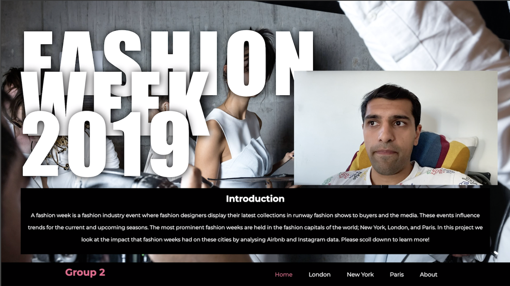

# London Fashion Week 2019 Analysis
Repository for CASA0003 Group Mini Project: Digital Visualisation made by Tianxin Li, Zhenzhi Zhang, Vishal Kumar

Website found here: http://vishalkumarlondon.github.io/fashion-week/index.html

## Abstract

London Fashion Week is one of the most hotly anticipated weeks in the fashion industry’s calendar. Traditionally, Fashion Week has been a very exclusive event that is intimidating for outsiders, however, in recent years it has become a more inclusive and popular event that is described by its organisers as a city wide “celebration of British creativity and innovation fashion” which overlaps with the music, food and art industries. Yet, over the years relatively little research has been done to observe the pulse of London Fashion Week using data science and social media data. This repo has been prepared in May 2020 as part of a Group Mini Project for the CASA0003 Digital Visualization module at CASA UCL in accordance with the theme "The Living City". The aim of our analysis is to understand in more detail how the city changes when London Fashion Week takes place by leveraging spatial data science and social media analysis. A website was built to illustrate and visualize our analysis and trends in a sophisticated and interactive manner and presents a novel way to analyze London Fashion Week.
